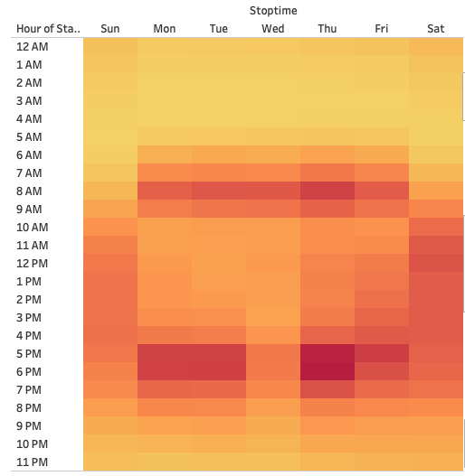
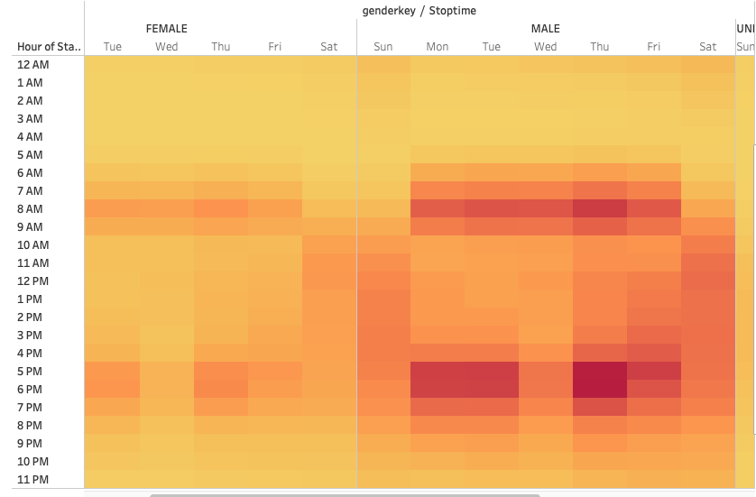
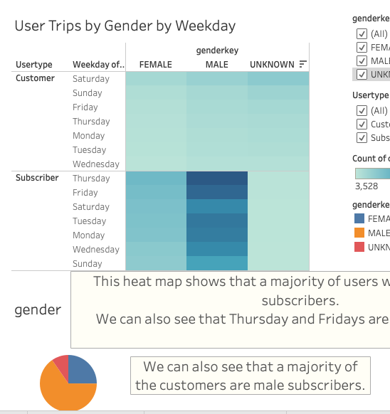
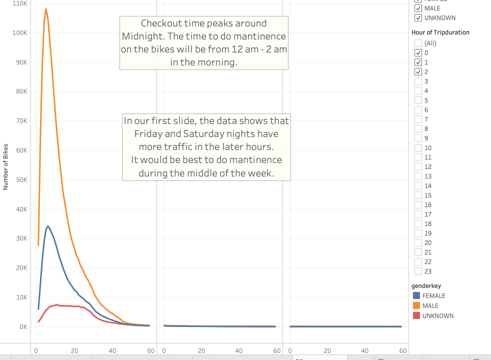
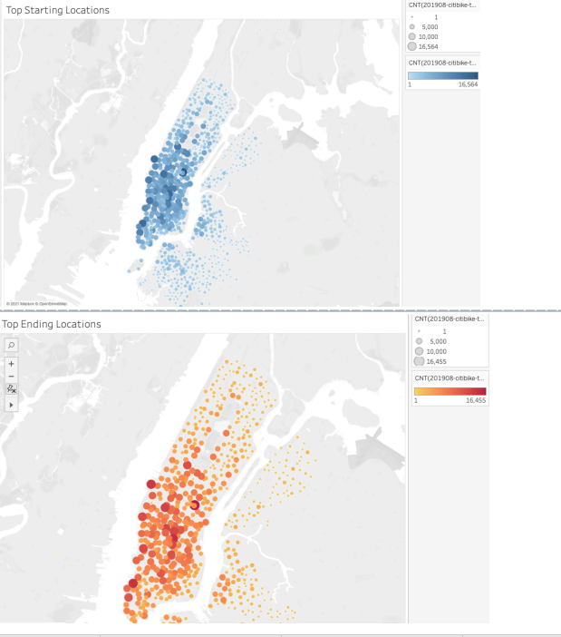

# Citibikes

## Overview
* The purpose of our work was to gather information and find trends/observations for citibikes in NYC. 
* Using Tableau and excel files, we were able to create different sorts of maps, graphs, and charts to help us with our findings. 
* With the data we gathered, our goal was to see if citibikes would be successful in Des Moines, Iowa.

## Results
* In our findings we have discovered some trends for citibikes in NYC.
* This heat map shows which times during the week are the most busy. 

* The next heat map shows the same as the first heat map, but shows the data for females and males.

* The next visual shows the usage per day by gender for subscribers and genders
* This visual also shows a pie chart that shows the usage of the citibikes by Male, Female, and Other.

* This graph shows the checkout times of the bikes, when they are most likely not in use. This will help with deciding when to do maintenence when neccessary.

* This visual shows two different maps which shows where citibike trips start and also end.

## Summary
* With our findings, we have discovered that a majority of citibikers in the NYC area are males who are subscribers.
* Most of the rides take place on weekdays from 7am - 9am and from 5pm - 7pm. This suggest that a majority of our riders use the bikes to get to and from work.
* The bikes are least likely to be used on weekdays after midnight. 
* We also discovered that most of the trips are centered towards the heart of the city. 

## Conclusion
* To conclude, for NYC, citibikes are mostly used by male subscibers, to get to and from work, and who are located in the middle of the city. 
* Citibikes are popular in NYC, but can they be succesfull in Des Moines, Iowa? 
* A visualization that would be helpful would be to gather information on the population density of Des Moines and compare it to the demographic of the people in the city. 
* Another visualization that would be helpful would be to see how many people drive cars in Des Moines. If a majority of people drive to work in the heart of Des Moines, an idea like citibikes might not work in such a city.

[https://public.tableau.com/app/profile/jacob.steinfeld/viz/Citibike_16376214433030/NYCCitiBikes?publish=yes](https://public.tableau.com/app/profile/jacob.steinfeld/viz/Citibike_16376214433030/NYCCitiBikes?publish=yes)

